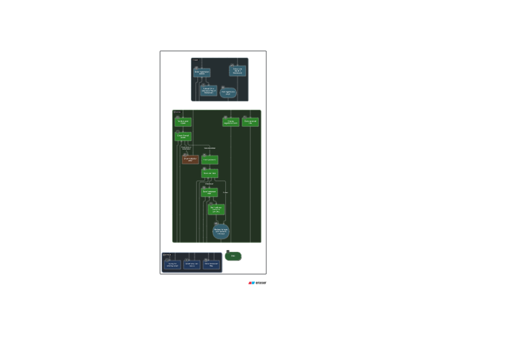
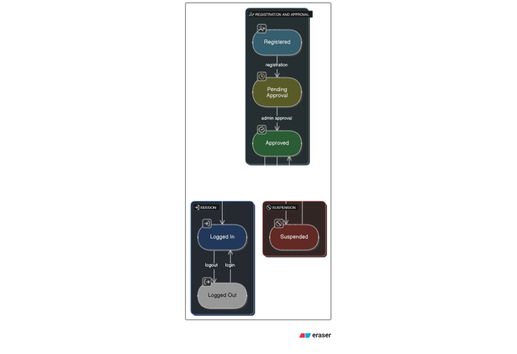

# Freelancer Platform Architecture

## Overview
This application follows the **MVC (Model-View-Controller)** architecture, a design pattern that separates concerns to enhance modularity, scalability, and maintainability. Below is a breakdown of the architecture and its implementation in the provided codebase.

## Architecture: MVC

### Model
- **Purpose**: Represents the data layer and business logic, interacting with the database (PostgreSQL in this case).
- **Implementation**:
  - Database interactions are handled using the `pg` package with a `Pool` configuration (see `app.js`).
  - User and profile data (e.g., clients, freelancers) are managed through database queries in `authcontroller.js`.
  - Example: `db.query` for user registration and profile creation/updates.

### View
- **Purpose**: Handles the presentation layer, rendering dynamic content to the user.
- **Implementation**:
  - Uses **EJS** as the templating engine (`app.js`: `app.set('view engine', 'ejs')`).
  - Views are rendered for pages like login (`auth/login`), registration (`auth/register`), and dashboards (e.g., `/client/dashboard`).
  - Layouts are managed with `express-ejs-layouts` for consistent UI structure.

### Controller
- **Purpose**: Manages the flow of data between the Model and View, handling user input and application logic.
- **Implementation**:
  - Controllers are defined in `authcontroller.js` (e.g., `getLogin`, `postRegisterClient`, `googleCallback`).
  - Routes map HTTP requests to controller functions (see `index.js` and route-specific files like `authRoutes`).
  - Middleware (e.g., `passport`, `helmet`) processes requests before they reach controllers.

## Additional Patterns and Features
- **Middleware-Based Design**: The app uses Express middleware (`morgan`, `helmet`, `passport`, `session`) for request processing, security, and authentication.
- **Modular Routing**: Routes are organized into separate modules (`authRoutes`, `clientRoutes`, etc.) for better maintainability (see `index.js`).
- **Authentication**: Combines local authentication (`passport-local`) and OAuth (Google) with role-based access control (client, freelancer, admin).
- **Error Handling**: Custom error handling for 404s and server errors is implemented in `app.js` and `index.js`.

## UML Diagrams

### Activity Diagram

- **Purpose**: Visualizes the workflow of user registration and authentication processes.

### Sequence Diagram

- **Purpose**: Illustrates the interaction between users, the application, and the database during login and registration.

### State Diagram

- **Purpose**: Depicts the states of a user account (e.g., pending, approved, logged in) and transitions.

### Class Diagram

- **Purpose**: Represents the static structure of the system, including entities like Users, Clients, and Freelancers.

